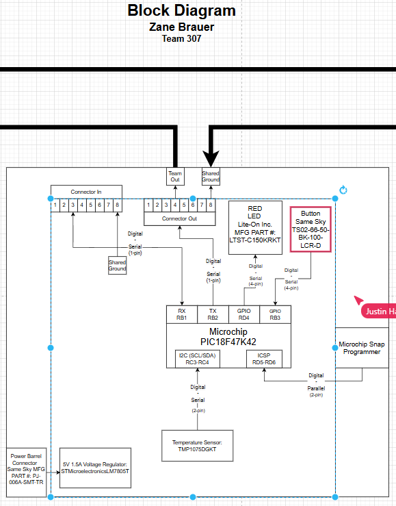

## Overview
* This subsystem represents **Zane Brauer's** portion of **Team 307’s** project.  
It focuses on detecting the temperature using a temperature sensor through the **Microchip PIC18F47K42 microcontroller.**

# System Description

This system has a **Temperature sensor** that recieves data from **Microchip PIC18F47K42 microcontroller** . The **Microchip PIC18F47K42 microcontroller** is the central controller of this subsystem, managing **serial signal I2C**. The other points in the diagram include the **actuator (LED output)** of the **system**, **communication interfaces**, and **team connector connections** for signal and power sharing. In total, the diagram presents **power levels, shared ground, signal flow, and module integration** in the system at hand.

---

# Power Configuration

The design uses the voltage level of: **5V, 1.5A regulated supply** for logic and sensors.  

---

## Individual Block Diagram 

