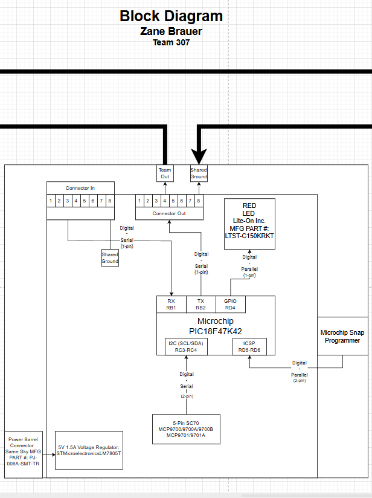

## Overview
This needs to be updated with a brief purpose for having the block diagram.
Things to mention are:
* power levels
* sensor
* Actuator
* team connections
* Power source
* ...

To get some initial formatting help, one can view ["here"](https://embedded-systems-design.github.io/EGR304DataSheetTemplate/Appendix/basic-markdown-examples/) some basic techniques.

## Individual Block Diagram 

