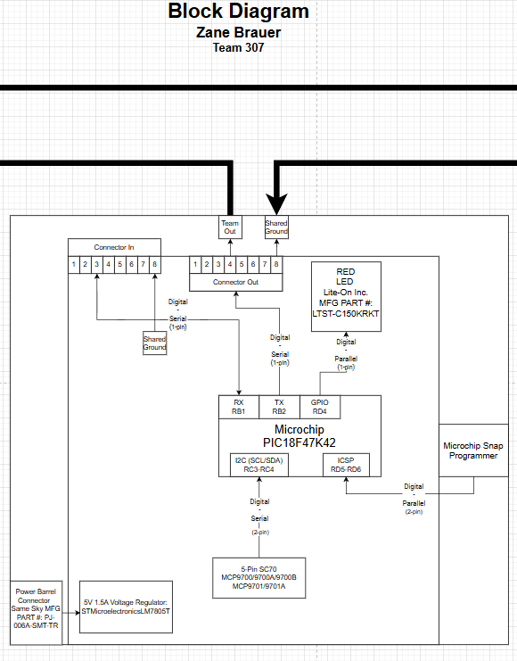

## Overview
* Overall, this block diagram shows the system and how the components are connected. It names the **power source** (DC barrel jack), the **5V voltage regulator**, and the distribution of regulated power throughout the system. The **Microchip PIC18F47K42 microcontroller** is the central controller of this subsystem, managing digital and serial signals. The other points in the diagram include the **actuator (LED output)** of the **system**, **communication interfaces**, and **team connector connections** for signal and power sharing. In total, the diagram presents **power levels, shared ground, signal flow, and module integration** in the system at hand.

## Individual Block Diagram 

