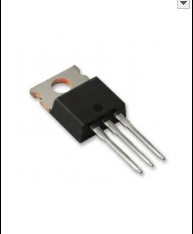
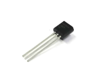
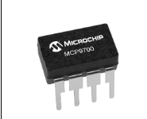
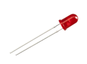
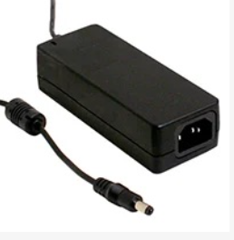
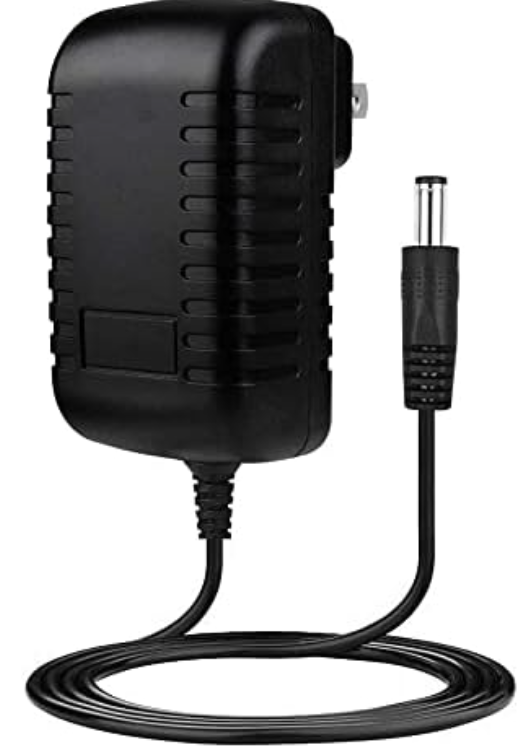
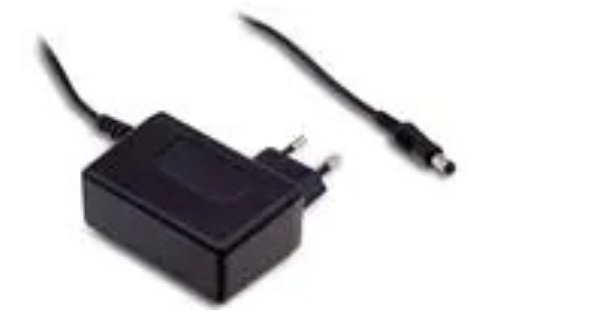
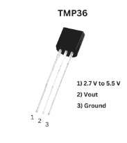
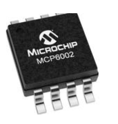

# Component Selection — Team 307

---

## 1. 5 V, 1.5 A Regulator

| Solution | Pros | Cons |
|-----------|------|------|
| **Option 1 — 7805 Linear Regulator (TO-220)**  Dropout ≈ 2 V Simple 2-capacitor application Price: ~$1–$2 (qty 1) [Product Page](https://www.digikey.com/en/products/filter/linear-voltage-regulators/699)  | • Very simple and low-noise output • Easy to source and short lead time • Excellent line/load regulation | • Inefficient from 12 V → 5 V • Needs heatsink above ~300 mA • Dropout ≈ 2 V limits low-Vin |
| **Option 2 — 5 V Buck Module (e.g., MP1584 / LM2596)**  High-efficiency step-down DC/DC Price: ~$2–$6 [Product Page](https://www.digikey.com/en/products/filter/dc-dc-converters/882)  | • High efficiency → runs cool from 12 V • Handles higher load current • Wide input range and adjustable output | • Switching ripple/noise requires filtering • PCB layout and EMI critical • More components; taller height |
| **Option 3 — MCP1825S-5002 (5 V LDO)**  1 A LDO, lower dropout than 7805 Price: ~$1–$2 [Product Page](https://www.digikey.com/en/products/detail/microchip-technology/MCP1825S-5002E-AB/1505941)  | • Lower dropout than 7805 • Quieter output than buck • Simple BOM | • Still linear → wastes heat • 1 A limit • Thermal design needed above a few hundred mA |

**Choice:** Option 1 — LM7805  
**Rationale:** We choose the LM7805 linear regulator based on providing a stable, low-noise 5 V output to be used for powering sensitive analog circuits or microcontrollers. Its two-capacitor application provides minimal required external parts and a straightforward PCB footprint, thus lowering the design complexity and potential points of failure on the PCB. Having used the LM7805 already in previous course work throughout the semester, the design team is accustomed to its behavior — less risky at stages of layout and debugging. Switching regulators (buck modules) might yield much higher efficiencies and lower power dissipation, particularly if the conversion is between 9 V or 12 V and 5 V, but such systems also present switching noise, require a careful PCB layout and filtering, and contribute additional complexity, which might not be justified for a fairly small current draw (~1.5 A max). That noise could interfere with analog signals (e.g., from sensors).

---

## 2. Temperature Sensor (Analog Output)

| Solution | Pros | Cons |
|-----------|------|------|
| **Option 1 — LM35 (analog 10 mV/°C)**  TO-92 or SOIC Price: ~$1–$3 [TI Product Page](https://www.ti.com/product/LM35)  | • Linear 10 mV/°C scaling • Low current; minimal external parts • Well-documented | • Analog output susceptible to noise • Needs buffering for long leads • Accuracy modest without calibration |
| **Option 2 — TMP1075DGKT**  2.7–5.5 V supply (750 mV @ 25 °C) Price: ~$1.03 [Product Page](https://www.digikey.com/en/products/detail/texas-instruments/TMP1075DGKT/9597135)  | • Digital I²C/SMBus interface • Low power consumption • Wide temp range (-55°C ~ 125°C) | •Limited measurement resolution compared to newer sensors • Requires microcontroller communication • Not ideal for extremely fast temperature changes |
| **Option 3 — MCP9700 (analog)**  Slope 10 mV/°C with 500 mV offset Price: < $1 [Microchip Page](https://www.microchip.com/en-us/product/MCP9700)  | • Low cost • Operates at 5 V • Compatible with PIC ADC | • Offset adds math/error • Accuracy ±2 °C typical • Still analog → noise/EMI sensitive |

**Choice:** Option 2 — TMP1075DGKT  
**Rationale:** The TMP36 was selected because it runs directly from a 5 V rail (the same for the rest of our MCU and analog circuitry), making the power supply design simple and eliminating the need for additional regulators. Its analog output makes it easy to connect to the ADC in the user’s microcontroller without needing the heavy digital communication overhead (such as I²C or SPI) that comes along with the requirement for complex digital communication, which reduces firmware complexity and the chances of communication bugs. Its low power consumption and temperature range of –40 °C to 125 °C makes it versatile for many different working conditions. Analog sensors are inherently more susceptible to noise and EMI compared to digital sensors, but the TMP36 demonstrates well-documented stable behavior; consequently any incoming noise can be mitigated along with proper grounding, filtering, and layout practices.

---

## 3. Barrel Jack

| Solution | Pros | Cons |
|-----------|------|------|
| **Option 1 —  PJ-006A-SMT-TR**  Price: ~$0.95/unit [Product Page](https://www.digikey.com/en/products/detail/same-sky-formerly-cui-devices/PJ-006A-SMT-TR/408456)  | • Standard barrel jack • Sufficient for application • Simple to install | • Shipping fee • Shipping fee • Must ensure correct polarity |
| **Option 2 — PJ-006B-SMT-TR**  Price: ~ $0.95/unit  [Product Page](https://www.digikey.com/en/products/detail/same-sky-formerly-cui-devices/PJ-006B-SMT-TR/408457)  | • Standard barrel connector size • Handles moderate power levels • Standard barrel connector size | • Limited current capacity compared to larger connectors • Mechanical stress on SMT pads • Requires specific barrel plug size |

**Choice:** Option 1 – PJ-006A-SMT-TR

**Rationale:** The PJ-006A-SMT-TR barrel jack was selected because it provides a reliable and simple method for supplying external DC power to the system. This connector supports standard 5.5 mm barrel plugs and can handle the moderate voltage and current levels required for the project’s 5 V regulated power system. Its surface-mount design allows it to be easily integrated into the PCB layout while maintaining a compact footprint. Additionally, the connector is inexpensive, widely available, and easy to use with common DC adapters, making it a practical choice for prototyping and testing. The straightforward two-contact design also simplifies wiring and reduces the chance of incorrect polarity connections when used with a regulated power supply.

---
## 4. Red LED Indicator (5 V MCU Pin + Resistor)

| Solution | Pros | Cons |
|-----------|------|------|
| **Option 1 — 5 mm Red LED (THT)**  Vf ≈ 2.0 V @ 20 mA Price: < $0.10 [Digikey Page](https://www.digikey.com/en/products/filter/led-indication-discrete/105)  | • Bright and easy to see • Breadboard-friendly • Durable leads | • Large footprint • Requires holes (through-hole) • Protrudes above PCB |
| **Option 2 — 0805 SMD Red LED** Vf ≈ 2.0 V typical Price: < $0.10 [Digikey Page](https://www.digikey.com/en/products/filter/led-indication-discrete/105)  | • Compact for tight PCBs • Suited for reflow assembly • Low parasitics | • Tricky to hand-solder • Less visible off-axis • Needs silkscreen polarity |
| **Option 3 — 1206 SMD Red LED** Vf ≈ 2.0 V typical Price: < $0.10 [Mouser Page](https://www.mouser.com/c/optoelectronics/leds/standard-leds-single-color/)  | • Bigger pads (easier hand-solder) • Still compact • Good visibility | • Needs resistor & stencil • Slightly larger area • Taller profile |
 
**Choice:** Option 1 — 5 mm Red LED (THT) 
**Rationale:** I chose to utilize a 5 mm through-hole (THT) red LED as it is bright and can be visible from different directions — which is good for your user experience for status indications or alerts. For a development or proof-of-concept board, visibility is often more critical than compactness, and THT LEDs can certainly serve as a practical aid for debugging, early prototype, or demonstration builds. The through-hole form factor also makes soldering and rework for prototypes or low-volume builds easier, and the components can be replaced and/or adjusted by hand if they need to be replaced or modified.

---

## 5. Button (User Interface Subsystem)

| Solution | Pros | Cons |
|-----------|------|------|
| **Option 1 — PTS645SL43-2 LFS Tactile Switch** Basic push button, low cost, easy to integrate Price: $0.24/each [Product Page](https://www.digikey.com/en/products/detail/c-k/PTS645SL43-2-LFS/1146755) [Datasheet](https://www.ckswitches.com/media/1471/pts645.pdf) .jpeg) | • Very low cost • Easy to use | • Short lifespan • Less tactile feedback |
| **Option 2 — Omron B3F Series Tactile Switch** High-quality tactile push button, reliable, long life Price: $0.24/each [Product Page](https://www.digikey.com/en/products/detail/omron-electronics-inc-emc-div/B3F-1000/33150) [Datasheet](https://omronfs.omron.com/en_US/ecb/products/pdf/en-b3f.pdf) .jpeg) | • Long lifespan (~1M presses) • Reliable actuation • Consistent tactile feel | • Slightly higher cost • Requires careful soldering |
| **Option 3 — Adafruit Mini Tactile Switch** Compact, low profile, low cost Price: $0.75/each [Product Page](https://www.adafruit.com/product/367) [Datasheet](https://cdn-shop.adafruit.com/datasheets/B3F-1000-Omron.pdf) .jpg) | • Compact • Low cost • Easy to use | • Shorter lifespan • Less tactile feel |

**Choice:** Option 2 — Omron B3F Series Tactile Switch  
**Rationale:** We included the Omron B3F tactile switch due to a high-quality tactile feel, a reliable actuation, and a long lifetime (on the order of 1 million actuations). For a user interface — where human interaction, button press feel, and durability matter — these features show a substantial difference in usability and user satisfaction. A button that feels cheap or fails after a few uses can really degrade the perceived quality of the product. Though there are also cost-effective competitors like simple tactile switches or compact mini-switches, these alternatives can often cause poor tactile feedback, inconsistency in the actuation force applied, shorter lifespan, and potentially unreliable switching over time. Even for a project that might be heavily tested through manual testing, debugging, or user interaction (particularly in a lab or classroom), this can be a major drawback.

## 6. 9V 3A Unregulated Power Supply (**Power Subsystem**)

### Option 1

| Solution | Pros | Cons |
|----------|------|------|
| **Mean Well GST40A09-P1J**  90W unregulated 9V DC power supply, high reliability Price: $17.30/each [Product Page](https://www.digikey.com/en/products/detail/mean-well-usa-inc/gst40a09-p1j/7703703) [Datasheet](https://www.meanwellusa.com/upload/pdf/GST40A/GST40A-spec.pdf) | - High reliability - Stable output - Protects circuits | - Bulkier - Expensive |

### Option 2

| Solution | Pros | Cons |
|----------|------|------|
| **Amazon Basics 9V 3A AC/DC Adapter (B09ZTKTLGW)**   regulated output, compact wall-plug design Price: $4.99/each [Product Page](https://www.amazon.com/gp/product/B09ZTKTLGW/) | - Affordable and widely available - Compact, plug-in wall adapter (saves space) - Regulated output ensures stable voltage - Includes standard barrel plug (5.5mm x 2.1mm) - Suitable for continuous operation | - Lower build quality compared to industrial brands - Limited protection features (no explicit overcurrent/short-circuit protection) - Not designed for harsh environments or high-reliability applications - May run warm under full load |

### Option 3

| Solution | Pros | Cons |
|----------|------|------|
| **Mean‑Well SGA40E09‑P1J**   Mean Well SGA40E09-P1J – 40W wall-mount (plug-in) AC/DC adapter, 9 V output, ~4.44 A max Price: $21.47/each [Product Page](https://www.mouser.com/ProductDetail/MEAN-WELL/SGA40E09-P1J?qs=kU9BrJCShyk7JuwjBVtOlQ%3D%3D&srsltid=AfmBOooYPFy-o8z2TKsX1w-nQ8iGEcE8ENDtLzemfdFMs3mg4elY-K3U&utm_source=chatgpt.com) [Datasheet](https://www.stathisnet.gr/image/SpecsUpload/028888.pdf?utm_source=chatgpt.com) | - Slim wall-mounted adapter (plug-in) form factor – simpler installation - 9 V × 4.44 A gives ~40W, plenty margin above 3 A requirement - High efficiency (reduces heat) and modern protections: Overcurrent, Overvoltage, Short-circuit built in | - Being plug-in, less modular for non-standard connector scenarios - Slightly higher cost compared to generic adapters - If input plug standard different (US vs EU), may require adapter or variant|

**Choice:** Option 2: Amazon Basics 9V 3A AC/DC Adapter (B09ZTKTLGW)  
**Rationale:** the Amazon Basics 9 V 3 A plug-in adapter because it is cost-effective, widely available, and straightforward to integrate into the design. As a wall-plug adapter, it simplifies the power architecture by avoiding bulky external power bricks or custom power supply enclosures. For prototyping, testing, and typical indoor use — which are the expected operating conditions for this system — a compact, plug-and-play adapter provides an excellent balance between convenience, simplicity, and sufficient power delivery. The regulated 9 V output ensures consistent input for downstream regulators or circuitry, helping to maintain stable operation even if wall outlet voltage fluctuates. Although this adapter lacks the industrial-grade protections (like overcurrent, over-voltage, short-circuit protection) and the ruggedness of a supply like the Mean Well GST40A09-P1J, such protections may not be strictly necessary for a classroom or home use prototype — especially when we are in control of the load and environment.

## Final Major Components Selected 

| Solution | Pros | Cons |
|-----------|------|------|
| **7805 Linear Regulator (TO-220)** Dropout ≈ 2 V Simple 2-capacitor application Price: ~$1–$2 (qty 1) [Product Page](https://www.digikey.com/en/products/filter/linear-voltage-regulators/699)  | • Very simple and low-noise output • Easy to source and short lead time • Excellent line/load regulation | • Inefficient from 12 V → 5 V • Needs heatsink above ~300 mA • Dropout ≈ 2 V limits low-Vin |
| **TMP36 (analog with offset)** 2.7–5.5 V supply (750 mV @ 25 °C) Price: ~$1–$2 [Analog Devices Page](https://www.analog.com/en/products/tmp36.html)  | • Works from 5 V rail • Low power and easy ADC interface • Wide temp range (−40 to 125 °C) | • Accuracy ±2 °C • Offset must be subtracted in firmware • Analog output needs filtering |
| **MCP6002 (dual, rail-to-rail I/O)** 1.8–5.5 V, 1 MHz GBW Price: ~$0.50–$1.50 [Microchip Page](https://www.microchip.com/en-us/product/MCP6002)  | • Rail-to-rail I/O at 5 V • Low quiescent current • Unity-gain stable | • Limited bandwidth (1 MHz) • Modest slew rate • Low output drive |
| **5 mm Red LED (THT)** Vf ≈ 2.0 V @ 20 mA Price: < $0.10 [Digikey Page](https://www.digikey.com/en/products/filter/led-indication-discrete/105)  | • Bright and easy to see • Breadboard-friendly • Durable leads | • Large footprint • Requires holes (through-hole) • Protrudes above PCB |
| **Omron B3F Series Tactile Switch** High-quality tactile push button, reliable, long life Price: $0.24/each [Product Page](https://www.digikey.com/en/products/detail/omron-electronics-inc-emc-div/B3F-1000/33150) [Datasheet](https://omronfs.omron.com/en_US/ecb/products/pdf/en-b3f.pdf) .jpeg) | • Long lifespan (~1M presses) • Reliable actuation • Consistent tactile feel | • Slightly higher cost • Requires careful soldering |
| **Amazon Basics 9V 3A AC/DC Adapter (B09ZTKTLGW)**  regulated output, compact wall-plug design Price: $4.99/each [Product Page](https://www.amazon.com/gp/product/B09ZTKTLGW/) | - Affordable and widely available - Compact, plug-in wall adapter (saves space) - Regulated output ensures stable voltage - Includes standard barrel plug (5.5mm x 2.1mm) - Suitable for continuous operation | - Lower build quality compared to industrial brands - Limited protection features (no explicit overcurrent/short-circuit protection) - Not designed for harsh environments or high-reliability applications - May run warm under full load |
---
