# Component Selection — Team 307

---

## 1. 5 V, 1.5 A Regulator

| Solution | Pros | Cons |
|-----------|------|------| 
| **Option 1 – TPS560430X3FDBVT Buck Regulator (TI)**  4 V–36 V input, 3 A step-down DC/DC Price: ~$1.58 (qty 1) [Product Page](https://www.digikey.com/en/products/detail/texas-instruments/TPS560430X3FDBVT/10251262) 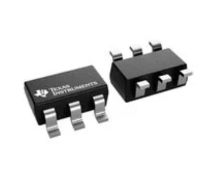 (https://mm.digikey.com/Volume0/opasdata/d220001/medias/images/3760/TPS560430.jpg) | • High efficiency switching regulator (≈90%+) • Handles higher current loads (~3 A capability) • Wide input voltage range suitable for many supplies | • Requires external components (inductor, capacitors) • Switching noise may require filtering and careful PCB layout • More complex design compared to linear regulators |
| **Option 2 — 5 V Buck Module (e.g., MP1584 / LM2596)**  High-efficiency step-down DC/DC Price: ~$2–$6 [Product Page](https://www.digikey.com/en/products/filter/dc-dc-converters/882) 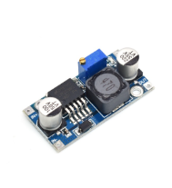 | • High efficiency → runs cool from 12 V • Handles higher load current • Wide input range and adjustable output | • Switching ripple/noise requires filtering • PCB layout and EMI critical • More components; taller height |
| **Option 3 — MCP1825S-5002 (5 V LDO)**  1 A LDO, lower dropout than 7805 Price: ~$1–$2 [Product Page](https://www.digikey.com/en/products/detail/microchip-technology/MCP1825S-5002E-AB/1505941) 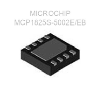 | • Lower dropout than 7805 • Quieter output than buck • Simple BOM | • Still linear → wastes heat • 1 A limit • Thermal design needed above a few hundred mA |

**Choice:** Option 1 — TPS560430X3FDBVT Buck Regulator (TI) 

**Rationale:** The TPS560430X3FDBVT buck regulator provides a highly efficient method for converting a higher input voltage down to the required 5 V supply. Unlike linear regulators, which dissipate excess voltage as heat, this switching regulator achieves efficiencies around 90%, significantly reducing power loss and heat generation when stepping down from higher voltages. This makes it well-suited for systems that may draw higher current or operate for extended periods. The regulator also supports a wide input voltage range (4–36 V) and can supply up to about 3 A, providing additional design margin beyond the 1.5 A requirement. Although it requires a few additional external components such as an inductor and capacitors, the improved efficiency, reduced thermal stress, and ability to handle higher loads make it the most reliable and scalable option for the system’s 5 V power supply.

---

## 2. Temperature Sensor (Analog Output)

| Solution | Pros | Cons |
|-----------|------|------|
| **Option 1 — LM20BIM7X/NOPB (analog, SC-70-5 SMT)**  TO-92 or SOIC Price: ~$0.81 [TI Product Page](https://www.digikey.com/en/products/detail/texas-instruments/LM20BIM7X-NOPB/366749?msockid=2b2475af6c1d6d1102ad67846d8e6cef) 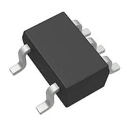 | • Better accuracy than many basic analog sensors, about ±1.5°C typical • Analog output works well with a PIC ADC • Surface-mount SC-70-5 package | • Still an analog sensor, so noise can affect readings • Output scaling is less straightforward than a simple 10 mV/°C sensor, about 11.77 mV/°C • Small package can be harder to hand-solder |
| **Option 2 — TMP1075DGKT**  2.7–5.5 V supply (750 mV @ 25 °C) Price: ~$1.03 [Product Page](https://www.digikey.com/en/products/detail/texas-instruments/TMP1075DGKT/9597135) 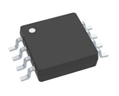 | • Digital I²C/SMBus interface • Low power consumption • Wide temp range (-55°C ~ 125°C) | •Limited measurement resolution compared to newer sensors • Requires microcontroller communication • Not ideal for extremely fast temperature changes |
| **Option 3 — MCP9700AT-E/TT**  Slope 10 mV/°C with 500 mV offset Price: < $0.48 [Product Page](https://www.digikey.com/en/products/detail/microchip-technology/MCP9700AT-E-TT/1228267?msockid=2b2475af6c1d6d1102ad67846d8e6cef) 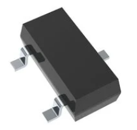 | • Simple 10 mV/°C analog output • Low cost and easy to interface with a microcontroller ADC • True surface-mount SOT-23-3 package | • Requires ADC conversion and software scaling in the microcontrolle •Lower accuracy than some digital temperature sensorsl • Analog output is still susceptible to noise/EMI |

**Choice:** Option 2 — TMP1075DGKT  
**Rationale:** The TMP1075DGKT was selected because of Its I²C/SMBus interface allows temperature data to be read directly by the MCU without needing analog-to-digital conversion, which improves measurement consistency and reduces the effect of noise compared to analog sensors. The sensor also has low power consumption and a wide operating temperature range, making it suitable for reliable use in different conditions. Although it requires microcontroller communication and software setup, its digital output, compact package, and stable performance make it the best choice for accurate temperature sensing in this design.

---

## 3. Barrel Jack

| Solution | Pros | Cons |
|-----------|------|------|
| **Option 1 —  PJ-006A-SMT-TR**  Price: ~$0.95/unit [Product Page](https://www.digikey.com/en/products/detail/same-sky-formerly-cui-devices/PJ-006A-SMT-TR/408456)  | • Standard barrel jack • Sufficient for application • Simple to install | • Shipping fee • Shipping fee • Must ensure correct polarity |
| **Option 2 — PJ-006B-SMT-TR**  Price: ~ $0.95/unit  [Product Page](https://www.digikey.com/en/products/detail/same-sky-formerly-cui-devices/PJ-006B-SMT-TR/408457)  | • Standard barrel connector size • Handles moderate power levels • Standard barrel connector size | • Limited current capacity compared to larger connectors • Mechanical stress on SMT pads • Requires specific barrel plug size |
| **Option 3 — PJ-102AH-SMT-TR**  Price: ~$0.85/unit [Product Page](https://www.digikey.com/en/products/detail/same-sky-formerly-cui-devices/PJ-102AH-SMT-TR/10247683)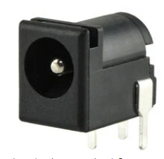 | • Surface-mount package compatible with PCB assembly • Standard 5.5 mm / 2.1 mm barrel connector size • Compact footprint for small PCB layouts | • SMT pads can experience mechanical stress from repeated plug use • Limited current compared to larger power connectors • Requires correct barrel plug size for proper contact |

**Choice:** Option 1 – PJ-006A-SMT-TR

**Rationale:** The PJ-006A-SMT-TR barrel jack was selected because it provides a reliable and simple method for supplying external DC power to the system. This connector supports standard 5.5 mm barrel plugs and can handle the moderate voltage and current levels required for the project’s 5 V regulated power system. Its surface-mount design allows it to be easily integrated into the PCB layout while maintaining a compact footprint. Additionally, the connector is inexpensive, widely available, and easy to use with common DC adapters, making it a practical choice for prototyping and testing. The straightforward two-contact design also simplifies wiring and reduces the chance of incorrect polarity connections when used with a regulated power supply.

---
## 4. Red LED Indicator (5 V MCU Pin + Resistor)

| Solution | Pros | Cons |
|-----------|------|------|
| **Option 1 – LTST-C150KRKT (SMD Red LED)**  Vf ≈ 2.0 V typical @ 20 mA Price: < $0.10 [Digikey Page](https://www.digikey.com/en/products/detail/lite-on-inc/LTST-C150KRKT/386800) 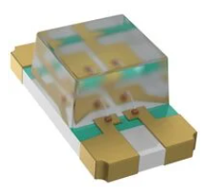 | • Small surface-mount footprint (0603 package) • Low forward voltage suitable for 5 V logic systems • Good brightness for indicator applications | • Very small size makes hand-soldering difficult • Less visible than larger LED packages • Requires current-limiting resistor |
| **Option 2 — 0805 SMD Red LED** Vf ≈ 2.0 V typical Price: < $0.10 [Digikey Page](https://www.digikey.com/en/products/filter/led-indication-discrete/105) 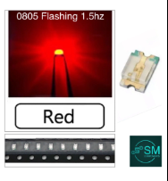 | • Compact for tight PCBs • Suited for reflow assembly • Low parasitics | • Tricky to hand-solder • Less visible off-axis • Needs silkscreen polarity |
| **Option 3 — 1206 SMD Red LED** Vf ≈ 2.0 V typical Price: < $0.10 [Mouser Page](https://www.mouser.com/c/optoelectronics/leds/standard-leds-single-color/) 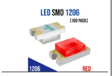 | • Bigger pads (easier hand-solder) • Still compact • Good visibility | • Needs resistor & stencil • Slightly larger area • Taller profile |
 
**Choice:** Option 1 — LTST-C150KRKT (SMD Red LED) 

**Rationale:**  The LTST-C150KRKT LED was selected because it is a compact surface mount component that fits well with the PCB based design of the system. It also has a typical forward voltage of about 2.0 V, which works well with the system’s 5 V logic when used with a current-limiting resistor. Although the small package can make manual soldering slightly more difficult, its small size and compatibility with surface-mount assembly make it the best option for the design. The TS02-66-50-BK-100-LCR-D tactile switch was selected because it provides a simple and reliable way for the user to interact with the system. Its surface-mount design allows it to be placed directly on the PCB while keeping the board layout compact.

---

## 5. Button (User Interface Subsystem)

| Solution | Pros | Cons |
|-----------|------|------|
| **Option 1 — PTS645SL43-2 LFS Tactile Switch** Basic push button, low cost, easy to integrate Price: $0.24/each [Product Page](https://www.digikey.com/en/products/detail/c-k/PTS645SL43-2-LFS/1146755) [Datasheet](https://www.ckswitches.com/media/1471/pts645.pdf) .jpeg) | • Very low cost • Easy to use | • Short lifespan • Less tactile feedback |
| **Option 2 – TS02-66-50-BK-100-LCR-D Tactile Switch** Compact surface-mount tactile push button Price: ~$0.25/each [Product Page](https://www.digikey.com/en/products/detail/c-k/TS02-66-50-BK-100-LCR-D/3755523) [Datasheet](https://www.ckswitches.com/media/1471/pts645.pdf) 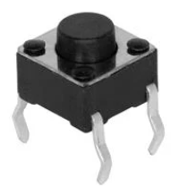(https://mm.digikey.com/Volume0/opasdata/d220001/medias/images/3847/TS02-66-50-BK-100-LCR-D.jpg) | • Surface-mount design for PCB assembly • Compact footprint for tight layouts • Reliable tactile feedback | • Requires careful soldering due to small pads • Lower actuation force may cause accidental presses • Not ideal for very heavy mechanical use |
| **Option 3 — Adafruit Mini Tactile Switch** Compact, low profile, low cost Price: $0.75/each [Product Page](https://www.adafruit.com/product/367) [Datasheet](https://cdn-shop.adafruit.com/datasheets/B3F-1000-Omron.pdf) .jpg) | • Compact • Low cost • Easy to use | • Shorter lifespan • Less tactile feel |

**Choice:** Option 2 — TS02-66-50-BK-100-LCR-D tactile switch 

**Rationale:**  The TS02-66-50-BK-100-LCR-D tactile switch was chosen because it provides a simple and reliable way for the user to interact with the system. It has a long working life and ensures consistent performance over time, suitable for repeated use. As the small pads demand careful soldering, the actuation force is relatively low, the small size, reliability, and ease of integration of the switch make it an ideal design for our user interface subsystem. The switch offers tactile feedback, which lets users actually feel when the button is pressed. 

## Final Major Components Selected 

| Solution | Pros | Cons |
|-----------|------|------|
| **TPS560430X3FDBVT Buck Regulator (TI)**  4 V–36 V input, 3 A step-down DC/DC Price: ~$1.58 (qty 1) [Product Page](https://www.digikey.com/en/products/detail/texas-instruments/TPS560430X3FDBVT/10251262)  (https://mm.digikey.com/Volume0/opasdata/d220001/medias/images/3760/TPS560430.jpg) | • High efficiency switching regulator (≈90%+) • Handles higher current loads (~3 A capability) • Wide input voltage range suitable for many supplies | • Requires external components (inductor, capacitors) • Switching noise may require filtering and careful PCB layout • More complex design compared to linear regulators |
| **TMP1075DGKT**  2.7–5.5 V supply (750 mV @ 25 °C) Price: ~$1.03 [Product Page](https://www.digikey.com/en/products/detail/texas-instruments/TMP1075DGKT/9597135)  | • Digital I²C/SMBus interface • Low power consumption • Wide temp range (-55°C ~ 125°C) | •Limited measurement resolution compared to newer sensors • Requires microcontroller communication • Not ideal for extremely fast temperature changes |
| **PJ-006A-SMT-TR**  Price: ~$0.95/unit [Product Page](https://www.digikey.com/en/products/detail/same-sky-formerly-cui-devices/PJ-006A-SMT-TR/408456)  | • Standard barrel jack • Sufficient for application • Simple to install | • Shipping fee • Shipping fee • Must ensure correct polarity |
| **LTST-C150KRKT (SMD Red LED)**  Vf ≈ 2.0 V typical @ 20 mA Price: < $0.10 [Digikey Page](https://www.digikey.com/en/products/detail/lite-on-inc/LTST-C150KRKT/386800)  | • Small surface-mount footprint (0603 package) • Low forward voltage suitable for 5 V logic systems • Good brightness for indicator applications | • Very small size makes hand-soldering difficult • Less visible than larger LED packages • Requires current-limiting resistor |
| **TS02-66-50-BK-100-LCR-D Tactile Switch** Compact surface-mount tactile push button Price: ~$0.25/each [Product Page](https://www.digikey.com/en/products/detail/c-k/TS02-66-50-BK-100-LCR-D/3755523) [Datasheet](https://www.ckswitches.com/media/1471/pts645.pdf) (https://mm.digikey.com/Volume0/opasdata/d220001/medias/images/3847/TS02-66-50-BK-100-LCR-D.jpg) | • Surface-mount design for PCB assembly • Compact footprint for tight layouts • Reliable tactile feedback | • Requires careful soldering due to small pads • Lower actuation force may cause accidental presses • Not ideal for very heavy mechanical use |
---
## Power Budget
---

## Overview
This Power Budget is an overview on just how much power should go into my circuit based off of each main conponent
in my circuit.

> Capture your power budge as a image to display. Take time to get clean breaks and a well organized layout.

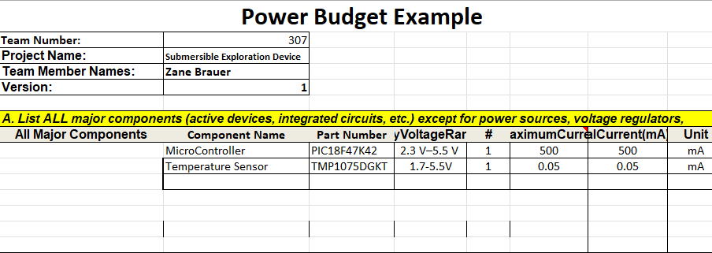{style width:"350" height:"300;"}

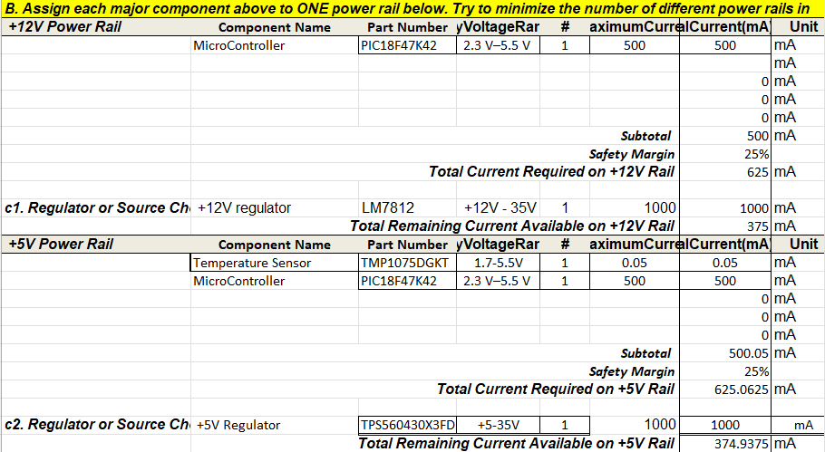{style width:"350" height:"300;"}

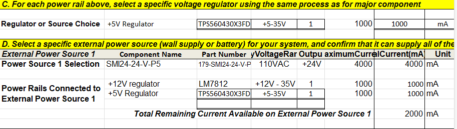{style width:"350" height:"300;"}

## Explanation And Conclusion

The power budget also serves to estimate the total current demand of the system. In addition it checks that the 5 V regulator and the external 9 V power supply are capable of safely supporting all connected components. Thus, a Power Budget prepared from this process ensures that the power system is not undersized, which could lead to voltage drops, unstable operation, overheating, or permanent component damage. From the prepare Power Budget, I now get a better understanding of how much power needs go go into my circuit and what exact power supply I need to ensure success on building this improved cirrcuit.

## Resouces

The power budget as a PDF download is available [*here*](Zane_Power_Budget_314.pdf), and a Microsoft Excel Sheet [*here*](PowerBudgetZB1.xlsx).
