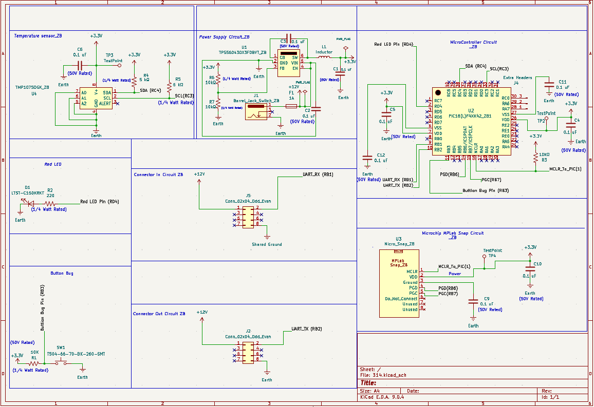

## Overview

This schematic is design to support recieving digital data from other subsystems, stores the data as well as 
computing temperature senssing data, and then sends both data's off to a new subsystem. This shows that the schematic is also designed to support digital communication between different subsystems as my subsystem both recieves and sends data.

{style width:"350" height:"300;"}
**Figure ##:** Showing a example schematic.

## Resouces

The schematic as a PDF download is available [*here*](ExampleSchematic.pdf), and the Zip folder of the project [*here*](dummyZip.zip).
