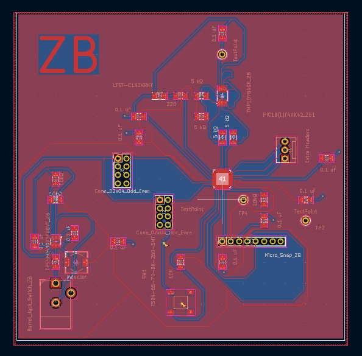
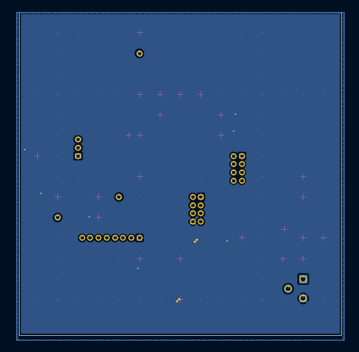

## Overview

This PCB is designed to support a value, PIC18(L)F4XK42 Microcontroller and a Temperature Sensor.

## PCB 3D-View

**Figure #1:** Showing Zane's Subsystem PCB Front.

**Figure #2:** Showing Zane's Subsystem PCB Rear.

 The PCB GERBER files can be accessed [*here*](301gbr314.zip).The PCB Project files can be accessed [*here*](Updated_PCB.zip).
